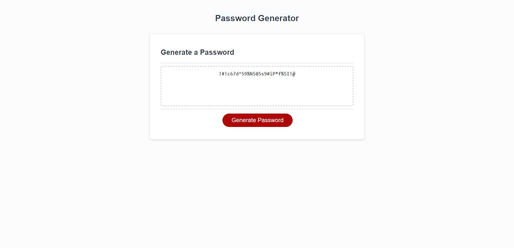

## <Challenge-03>

## Description

- My motivation for building this project was to create a password generator that could be used to obtain a truly random and secure password.
- I built this project so that when I need a password I can use a generator to create a secure one.
- It solves the problem of having to use the same unsafe password for every website, if paired with a text document you could create a list of all created passwords
- Throughout this project I learned a lot about Javascript. Random number functions, list item iteration, and how frequently you use variables to just name a fraction of them.

## Installation

https://mitchell4563.github.io/Challenge-03/

## Usage

https://mitchell4563.github.io/Challenge-03/

- Upon clicking the generate password button, you will be prompted about the preferred length of the password. If you enter a number between 8-128 characters, you will then be prompted about which character types you want to include in the password. After answering the four prompts your generated password will display in the box located in the center of the screen

## Credits

- N/A

## License

- Please refer to the license in the repo